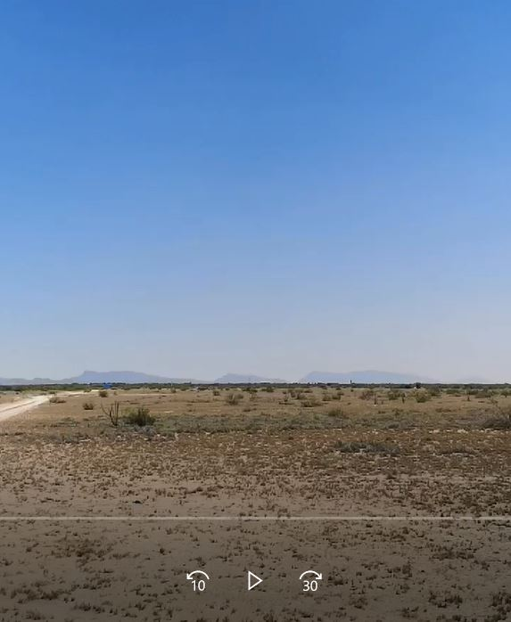
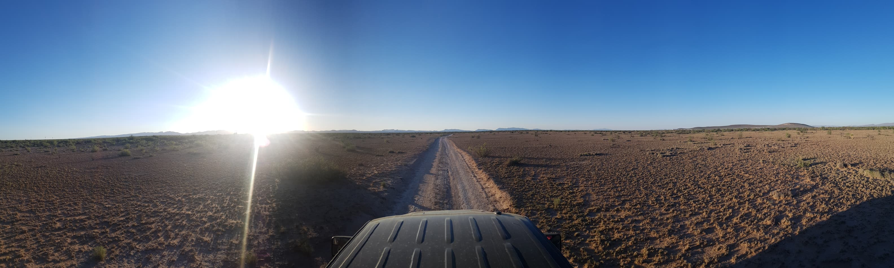
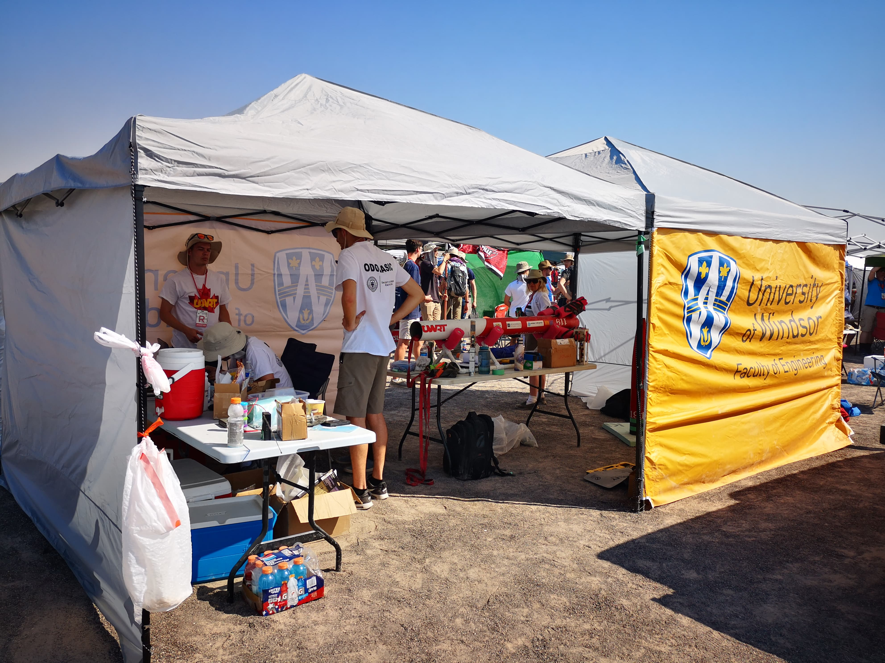
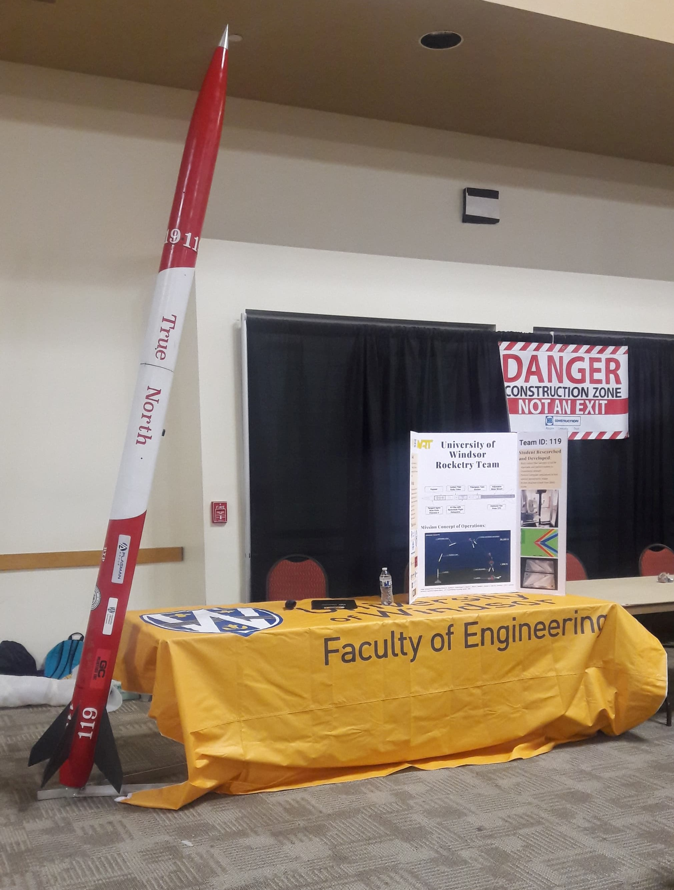
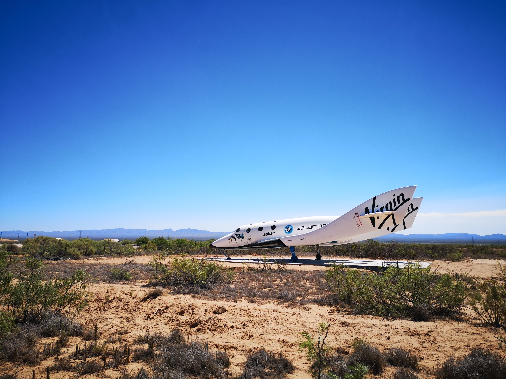

This project was part of my fourth year university capstone class. We participated at the Spaceport America Cup in the 30k ft COTS category and reached almost 27000 ft!

Check out our launch!

More cool pictures from New Mexico

  

