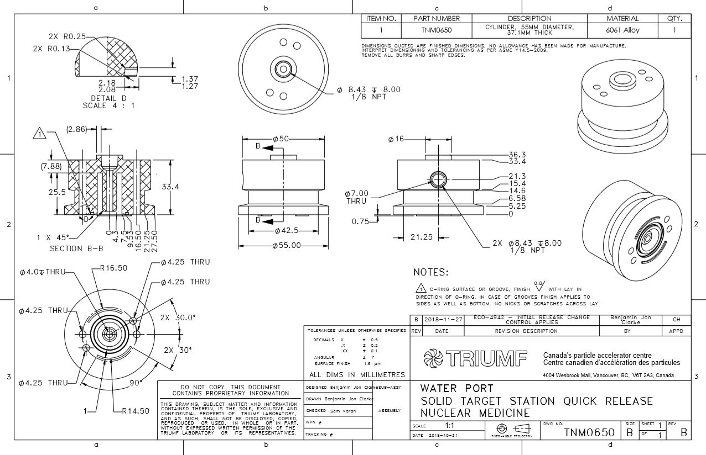

This project was part of the Life Sciences division of TRIUMF to develop a solid target quick-release for their TR13 Cyclotron. It increased production for medical isotopes for the BC Cancer Agency!

